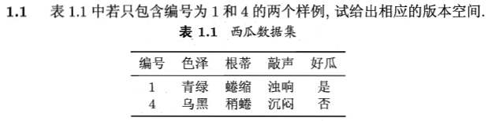
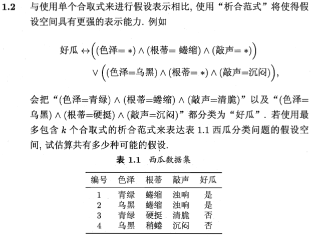
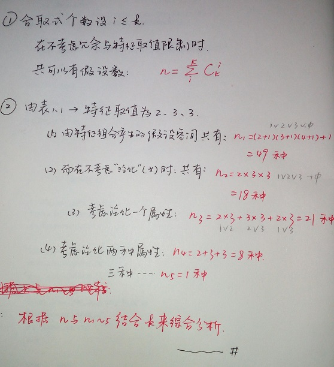
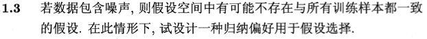

## 本章概要 ##
本章从如何挑选西瓜的经验出发，介绍了本书所涉及**基本术语和概念**。

> 数据集、样本、特征（属性）、特征空间（属性空间、样本空间、输入空间）、特征向量、维数；

> 学习（训练）、训练数据、训练样本、假设、预测、标记、样例、标记空间（输出空间）、测试、测试样本；

> 分类、回归、聚类、簇、监督、无监督、泛化能力；

> 归纳、演绎、概念学习、假设空间、版本空间；

> 归纳偏好（偏好）、奥卡姆剃刀；

同时简要介绍了机器学习的发展史。

> 符号主义、连接主义、机器学习、数据挖掘、统计学；

## 习题解答 ##

#### 1.1 版本空间 ####
>

当前的特征维度为3（色泽、根蒂、敲声），共3、2、2种取值，1，4的特征完全不同

根据版本空间的定义（版本空间指的是与训练集一致的假设空间），由表可知，1，4样例各特征取值均不同，于是得出当前的版本空间为：

----

#### 1.2 折合范式提升假设空间表示能力 ####
>

首先给出相关定义，合取范式：[Conjunctive normal form - Wikipedia](https://en.wikipedia.org/wiki/Conjunctive_normal_form)，析合范式：[Conjunctive normal form - Wikipedia](https://en.wikipedia.org/wiki/Disjunctive_normal_form)。

然后考虑问题。本题采用析合范式来提升假设空间，解答思路如下图：
>

----
#### 1.3 噪声下的归纳偏好设计 ####
>

- 最简单的设计就是：训练样本一致特征越多越好（一致性比例越高越好）为归纳偏好。
- 另外，考虑归纳偏好应尽量与问题相匹配，这里可使归纳偏好与噪声分布相匹配。

----
另外1.4与1.5题未完成。

