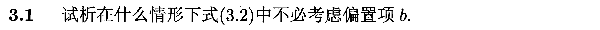
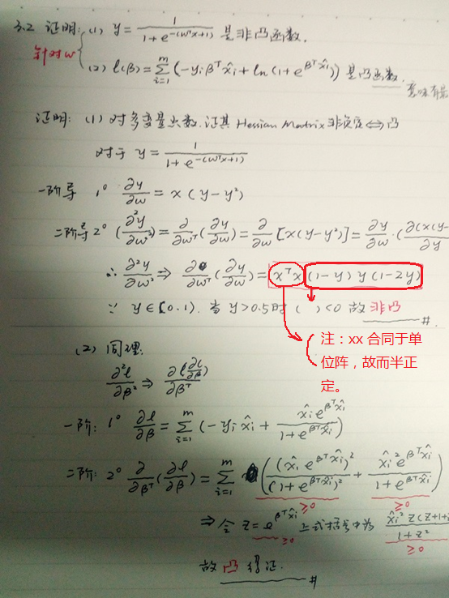
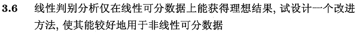
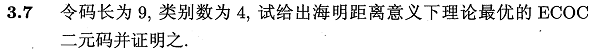
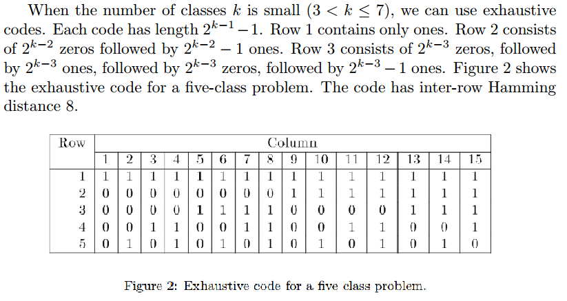
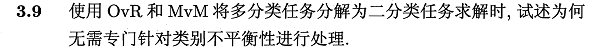

## 本章概要 ##
本章开始涉及编程练习，这里采用**Python-sklearn**的方式，环境搭建可参考[ 数据挖掘入门：Python开发环境搭建（eclipse-pydev模式）](http://blog.csdn.net/snoopy_yuan/article/details/61211639).

相关答案和源代码托管在我的Github上：[PY131/Machine-Learning_ZhouZhihua](https://github.com/PY131/Machine-Learning_ZhouZhihua).

本章讲述**线性模型**（linear model），相关内容包括：

- 线性回归（linear regression）

> 序关系（order）、均方差（square error）最小化、欧式距离（Euclidean distance）、**最小二乘法**（least square method）、参数估计（parameter estimation）、多元线性回归（multivariate linear regression）、广义线性回归（generalized linear model）、对数线性回归（log-linear regression）；

- 对数几率回归（逻辑回归）（logistic regression）

> 分类、Sigmoid函数、对数几率（log odds / logit）、极大似然法（maximum likelihood method）；

- 线性判别分析（linear discriminant analysis - LDA）

> 类内散度（within-class scatter）、类间散度（between-class scatter）；

- 多分类学习（multi-classifier）

> 拆解法，一对一（One vs One - OvO）、一对其余（OvR）、多对多（MvM）、纠错输出码（ECOC）、编码矩阵（coding matrix）、二元码、多标记学习（multi-label learning）；

- 类别不平衡（class-imbalance）

> 再缩放（rescaling）、欠采样（undersampling）、过采样（oversampling）、阈值移动（threshold-moving）；

## 习题解答 ##

#### 3.1 线性回归模型偏置项 ####
> 

偏置项b在数值上代表了自变量取0时，因变量的取值；

1.当讨论变量x对结果y的影响，不用考虑b；
2.可以用变量归一化（max-min或z-score）来消除偏置。

----

#### 3.2 证明对数似然函数是凸函数（参数存在最优解） ####
> 

直接给出证明结果如下图：

> 

----

#### 3.3 编程实现对率回归 ####
> 

所使用的数据集如下：
> 

本题是本书的第一个编程练习，采用了自己编程实现和调用sklearn库函数两种不同的方式（[查看完整代码](https://github.com/PY131/Machine-Learning_ZhouZhihua/tree/master/ch3_linear_model/3.3_logistic_regression_watermelon/)）：

具体的实现过程见：[周志华《机器学习》课后习题解答系列（四）：Ch3.3 - 编程实现对率回归](http://blog.csdn.net/snoopy_yuan/article/details/63684219)

----

#### 3.4 比较k折交叉验证法与留一法 ####
> 

本题采用UCI中的[iris data set](http://archive.ics.uci.edu/ml/datasets/Iris) 和 [Blood Transfusion Service Center Data Set](http://archive.ics.uci.edu/ml/datasets/Blood+Transfusion+Service+Center) 数据集，借助sklearn实现（[查看完整代码](https://github.com/PY131/Machine-Learning_ZhouZhihua/tree/master/ch3_linear_model/3.4_cross_validation)）。

具体的实现过程见：[周志华《机器学习》课后习题解答系列（四）：Ch3 - 3.4.交叉验证法练习](http://blog.csdn.net/snoopy_yuan/article/details/64131129)

----

#### 3.5 编程实现线性判别分析 ####
> 

本题采用题3.3的西瓜数据集，采用基于sklearn实现和自己独立编程实现两种方式（[查看完整代码](https://github.com/PY131/Machine-Learning_ZhouZhihua/tree/master/ch3_linear_model/3.5_LDA)）。

具体的实现过程见：[周志华《机器学习》课后习题解答系列（四）：Ch3 - 3.5.编程实现线性判别分析](http://blog.csdn.net/snoopy_yuan/article/details/64443841)

----

#### 3.6 线性判别分析的非线性拓展思考 ####

> 

给出两种思路：

- 参考书p57，采用**广义线性模型**，如 y-> ln(y)。
- 参考书p137，采用**核方法**将非线性特征空间隐式映射到线性空间，得到**KLDA**（核线性判别分析）。

----

#### 3.7 最优ECOC编码方式 ####

> 

参考书p65，*对于同等长度的编码，理论上来说，任意两个类别间的编码距离越远，纠错能力越强*。那么如何实现呢，可参考文献[Error-Correcting Output Codes](http://www.ccs.neu.edu/home/vip/teach/MLcourse/4_boosting/lecture_notes/ecoc/ecoc.pdf)。下图是截取文中的关于在较少类时采用**exhaustive codes**来生成最优ECOC二元码的过程：

> 

采用文中方法，每两类的Hamming Distance均达到了码长的一半，这也是最优的编码方式之一。

----

#### 3.9 多分类到二分类分解、类别不平衡 ####

> 

参考书p66，*对OvR、MvM来说，由于对每类进行了相同的处理，其拆解出的二分类任务中类别不平衡的影响会相互抵销，因此通常不需专门处理。*

以**OvR**（一对其余）为例，由于其每次以一个类为正其余为反（参考书p63），共训练出N个分类器，在这一过程中，类别不平衡由O的遍历而抵消掉。

----

