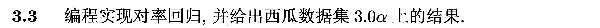
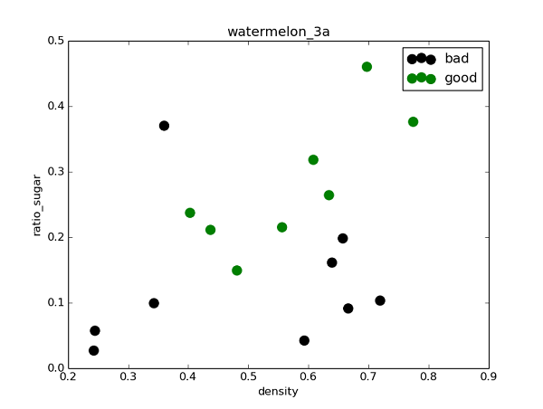
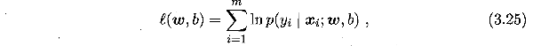
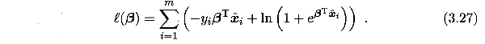
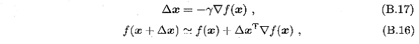
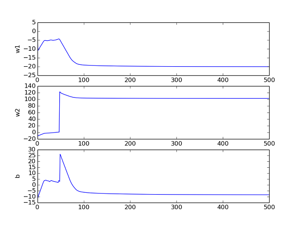

这里采用**Python-sklearn**的方式，环境搭建可参考[ 数据挖掘入门：Python开发环境搭建（eclipse-pydev模式）](http://blog.csdn.net/snoopy_yuan/article/details/61211639).

相关答案和源代码托管在我的Github上：[PY131/Machine-Learning_ZhouZhihua](https://github.com/PY131/Machine-Learning_ZhouZhihua).

#### 3.3 编程实现对率回归 ####
> 

所使用的数据集如下：
> 

本题是本书的第一个编程练习，采用了自己编程实现和调用sklearn库函数两种不同的方式，详细解答和编码过程：（[查看完整代码]()）：

##### 1.获取数据、查看数据、预处理： #####

观察数据可知，X包含（密度、含糖量）两个变量，y为西瓜是否好瓜分类（二分），由此生成.csv数据文件，在Python中用Numpy读取数据并采用matplotlib库可视化数据：
	
样例代码：

	'''
	data importion
	'''
	import numpy as np
	import matplotlib.pyplot as plt  
	
	# load the CSV file as a numpy matrix
	dataset = np.loadtxt('../data/watermelon_3a.csv', delimiter=",")
	
	# separate the data from the target attributes
	X = dataset[:,1:3]
	y = dataset[:,3]
	
	# draw scatter diagram to show the raw data
	f1 = plt.figure(1)   
	plt.title('watermelon_3a')  
	plt.xlabel('density')  
	plt.ylabel('ratio_sugar')  
	plt.scatter(X[y == 0,0], X[y == 0,1], marker = 'o', color = 'k', s=100, label = 'bad')
	plt.scatter(X[y == 1,0], X[y == 1,1], marker = 'o', color = 'g', s=100, label = 'good')
	plt.legend(loc = 'upper right')  
	plt.show()

> 

##### 2.采用sklearn逻辑回归库函数直接拟合： #####

虽然样本量很少，这里还是先划分训练集和测试集，采用sklearn.model_selection.train_test_split()实现，然后采用sklearn.linear_model.LogisticRegression，基于训练集直接拟合出逻辑回归模型，然后在测试集上评估模型（查看混淆矩阵和F1值）。
	
样例代码：

	''' 
	using sklearn lib for logistic regression
	'''
	from sklearn import model_selection
	from sklearn.linear_model import LogisticRegression
	from sklearn import metrics

	# generalization of test and train set
	X_train, X_test, y_train, y_test = model_selection.train_test_split(X, y, test_size=0.5, random_state=0)

	# model training
	log_model = LogisticRegression() 
	log_model.fit(X_train, y_train) 

	# model testing
	y_pred = log_model.predict(X_test)
	
	# summarize the accuracy of fitting
	print(metrics.confusion_matrix(y_test, y_pred))
	print(metrics.classification_report(y_test, y_pred))

得出混淆矩阵和相关度量（查准率（准确率）、查全率（召回率），F1值）结果如下：

	[[4 1]
	 [1 3]]
	             precision    recall  f1-score   support
	
	        0.0       0.80      0.80      0.80         5
	        1.0       0.75      0.75      0.75         4
	
	avg / total       0.78      0.78      0.78         9

由混淆矩阵可以看到，由于样本本身数量较少，模型拟合效果一般，总体预测精度约为0.78。为提升精度，可以采用**自助法**进行重抽样扩充数据集，或是采用**交叉验证**选择最优模型。

下图是采用matplotlib.contourf绘制的决策区域和边界，可以看出对率回归分类器还是成功的分出了绝大多数类：

> 

##### 3.自己编程实现逻辑斯蒂回归 #####

编程实现逻辑回归的主要工作是求取参数w和b（见书p59），最常用的参数估计方法是**极大似然法**，由于题3.1已经证得对数似然函数（见书3.27）是凸函数，存在最优解，这里考虑采用**梯度下降法**来迭代寻优。

回顾一下Sigmoid函数，即逻辑斯蒂回归分类器的基础模型：

> 

目的是基于数据集求出最优参数w和b，最常采用的是极大似然法，参数的似然函数为：

> 

根据书p59，最大化上式等价于最小化下式：

> 

题3.2已证上式为凸函数，一定存在最小值，但按照导数为零的解析求解方式较为困难，于是考虑采用梯度下降法来求解上式最小值时对应的参数。

注：梯度下降法基本知识可参考书中附录p409页，也可直接采用书中p60式3.30偏导数公式。书中关于参数迭代改变式子如下：

> 

对于迭代，可每次先根据(B.16)计算出梯度▽f(β)，然后由(B.17)更新得出下一步的Δβ。

接下来编程实现基本的梯度下降法：

(1)首先编程实现对象式3.27：

	def likelihood_sub(x, y, beta):
	    '''
	    @param x: one sample variables
	    @param y: one sample label
	    @param beta: the parameter vector in 3.27
	    @return: the sub_log-likelihood of 3.27  
	    ''' 
	    return -y * np.dot(beta, x.T) + np.math.log(1 + np.math.exp(np.dot(beta, x.T)))   

	def likelihood(X, y, beta):
	    '''
	    @param X: the sample variables matrix
	    @param y: the sample label matrix
	    @param beta: the parameter vector in 3.27
	    @return: the log-likelihood of 3.27  
	    '''
	    sum = 0
	    m,n = np.shape(X)  
	    
	    for i in range(m):
	        sum += likelihood_sub(X[i], y[i], beta)
	                                                 
	    return sum   

(2)然后基于训练集（注意x->[x,1]），给出基于3.27似然函数的**定步长梯度下降**法，注意这里的**偏梯度**实现技巧：

	'''
    @param X: X is the variable matrix 
    @param y: y is the label array
    @return: the best parameter estimate of 3.27
    '''
	def gradDscent_1(X, y):  #implementation of basic gradDscent algorithms
    
	    h = 0.1  # step length of iteration
	    max_times= 500  # give the iterative times limit
	    m, n = np.shape(X)

	    beta = np.zeros(n)  # parameter and initial to 0
	    delta_beta = np.ones(n)*h  # delta parameter and initial to h
	    llh = 0
	    llh_temp = 0
	    
	    for i in range(max_times):
	        beta_temp = beta
	        
			# for partial derivative 
	        for j in range(n): 
	            beta[j] += delta_beta[j]
	            llh_tmp = likelihood(X, y, beta)
	            delta_beta[j] = -h * (llh_tmp - llh) / delta_beta[j]	            
	            beta[j] = beta_temp[j]
	            
	        beta += delta_beta            
	        llh = likelihood(X, y, beta)
             
	    return beta

通过追踪参数，查看其收敛曲线，然后来调节相关参数（步长h，迭代次数max_times）。下图是在当前参数取值下的beta曲线，可以看到其收敛良好：

> 

(3)最后建立Sigmoid预测函数，对测试集数据进预测，得到混淆矩阵如下：

	[[ 4.  1.]
	 [ 1.  3.]]

可以看出其总体预测精度（7/9 ≈ 0.78）与调用sklearn库得出的结果相当。

(4)采用**随机梯度下降**法来优化：上面采用的是全局定步长梯度下降法（称之为**批量梯度下降**），这种方法在可能会面临收敛过慢和收敛曲线波动情况的同时，每次迭代需要全局计算，计算量随数据量增大而急剧增大。所以尝试采用随机梯度下降来改善参数迭代寻优过程。

随机梯度下降法的核心思想是**增量**学习：一次只用一个新样本来更新回归系数，从而形成在线流式处理。

同时为了加快收敛，采用**变步长**的策略，h随着迭代次数逐渐减小。

给出变步长随机梯度下降法的代码如下：
	
	def gradDscent_2(X, y):  #implementation of stochastic gradDscent algorithms
	    '''
	    @param X: X is the variable matrix 
	    @param y: y is the label array
	    @return: the best parameter estimate of 3.27
	    '''
	    import matplotlib.pyplot as plt  
	
	    m, n = np.shape(X)
	    h = 0.5  #  step length of iterator and initial
	    beta = np.zeros(n)  # parameter and initial
	    delta_beta = np.ones(n) * h
	    llh = 0
	    llh_temp = 0
	
	    for i in range(m):
	        beta_temp = beta	# for partial derivative 
	        
	        for j in range(n): 
	            h = 0.5 * 1 / (1 + i + j)  # change step length of iterator 
	            beta[j] += delta_beta[j]
	            llh_tmp = likelihood_sub(X[i], y[i], beta)
	            delta_beta[j] = -h * (llh_tmp - llh) / delta_beta[j]   
	            beta[j] = beta_temp[j]  
	               
	        beta += delta_beta    
	        llh = likelihood_sub(X[i], y[i], beta)

	    return beta

得出混淆矩阵：

	[[ 3.  2.]
	 [ 0.  4.]]

从结果看到的是：由于这里的西瓜数据集并不大，所以随机梯度下降法采用一次遍历所得的结果不太好，参数也没有完成收敛。这里只是给出随机梯度下降法的实现样例，这种方法在大数据集下相比批量梯度法应会有明显的优势。

----

参考链接：
由于这是本书第一个编程，索引资料较多，择其重要的一些列出如下：

- [Introduction to Machine Learning with Python and Scikit-Learn](https://kukuruku.co/post/introduction-to-machine-learning-with-python-andscikit-learn/)
- [scikit-learn官方主页](http://scikit-learn.org/stable/index.html)
- [matplotlib官方主页](http://matplotlib.org/index.html)
- [随机梯度下降（Stochastic gradient descent）和批量梯度下降（Batch gradient descent）的公式对比、实现对比](http://blog.csdn.net/lilyth_lilyth/article/details/8973972)
- [机器学习算法与Python实践之（七）逻辑回归（Logistic Regression）](http://blog.csdn.net/zouxy09/article/details/20319673)
- [plot decision boundary matplotlib
Ask（matplotlib决策区域和边界绘制](http://stackoverflow.com/questions/19054923/plot-decision-boundary-matplotlib)
- [Python数据可视化——散点图](http://blog.csdn.net/abcjennifer/article/details/19848269)