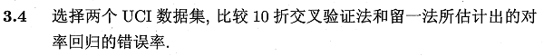
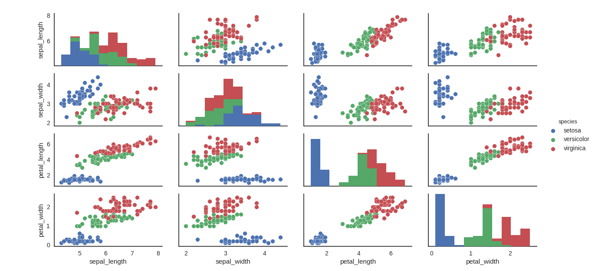

本系列主要采用**Python-sklearn**实现，环境搭建可参考[ 数据挖掘入门：Python开发环境搭建（eclipse-pydev模式）](http://blog.csdn.net/snoopy_yuan/article/details/61211639).

相关答案和源代码托管在我的Github上：[PY131/Machine-Learning_ZhouZhihua](https://github.com/PY131/Machine-Learning_ZhouZhihua).

### 3.4 比较k折交叉验证法与留一法 ###
> 

本题采用UCI中的 [Iris Data Set](http://archive.ics.uci.edu/ml/datasets/Iris) 和 [Blood Transfusion Service Center Data Set](http://archive.ics.uci.edu/ml/datasets/Blood+Transfusion+Service+Center)，基于sklearn完成练习（[查看完整代码](https://github.com/PY131/Machine-Learning_ZhouZhihua/tree/master/ch3_linear_model/3.4_cross_validation)）。

关于数据集的介绍：

[IRIS数据集简介 - 百度百科](http://baike.baidu.com/item/IRIS/4061453#viewPageContent)；通过花朵的性状数据（花萼大小、花瓣大小...）来推测花卉的类别。变量属性X=4种，类别标签y公有3种，这里我们选取其中两类数据来拟合对率回归(逻辑斯蒂回归)。

[Blood Transfusion Service Center Data Set - UCI](http://archive.ics.uci.edu/ml/datasets/Blood+Transfusion+Service+Center);通过献血行为（上次献血时间、总献血cc量...）的历史数据，来推测某人是否会在某一时段献血。变量属性X=4种，类别y={0,1}。该数据集相对iris要大一些。

具体过程如下：

#### 1. 数据导入、可视化、预分析： ####

iris数据集十分常用，sklearn的数据包已包含该数据集，我们可以直接载入。对于transfusion数据集，我们从UCI官网上下载导入即可。

采用**seaborn**库可以实现基于matplotlib的非常漂亮的可视化呈现效果，下图是采用seaborn.pairplot()绘制的iris数据集各变量关系组合图，从图中可以看出，类别区分十分明显，分类器应该比较容易实现：

> 

相关样例代码：

	import numpy as np
	import seaborn as sns
	sns.set(style="white", color_codes=True)
	iris = sns.load_dataset("iris")
	
	iris.plot(kind="scatter", x="sepal_length", y="sepal_width")
	sns.pairplot(iris,hue='species') 
	sns.plt.show()

#### 2. 基于sklearn进行拟合与交叉验证： ####

这里我们选择iris中的两类数据对应的样本进行分析。k-折交叉验证（1<k<n-1)可直接根据sklearn.model_selection.cross_val_predict()得到精度、F1值等度量。留一法稍微复杂一点，这里采用loop实现。

面向iris数据集的样例代码：

	'''
	2-nd logistic regression using sklearn
	'''
	from sklearn.linear_model import LogisticRegression
	from sklearn import metrics
	from sklearn.model_selection import cross_val_predict
	
	# log-regression lib model
	log_model = LogisticRegression()
	m = np.shape(X)[0]
	
	# 10-folds CV
	y_pred = cross_val_predict(log_model, X, y, cv=10)
	print(metrics.accuracy_score(y, y_pred))
	    
	# LOOCV
	from sklearn.model_selection import LeaveOneOut
	loo = LeaveOneOut()
	accuracy = 0;
	for train, test in loo.split(X):
	    log_model.fit(X[train], y[train])  # fitting
	    y_p = log_model.predict(X[test])
	    if y_p == y[test] : accuracy += 1  
	print(accuracy / np.shape(X)[0])

得出了精度（预测准确度）结果如下：

	0.97
	0.96

可以看到，两种方法的模型精度都十分高，这也得益于iris数据集类间散度较大。

同样的方法对blood-transfusion数据集得出的精度结果：

	0.76
	0.77

也可以看到，两种交叉验证的结果相近，但是由于此数据集的类分性不如iris明显，所得结果也要差一些。同时由程序运行可以看出，**LOOCV的运行时间相对较长**，这一点随着数据量的增大而愈发明显。

所以，一般情况下选择K-折交叉验证即可满足精度要求，同时运算量相对小。

----

