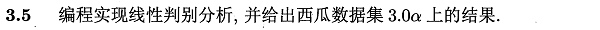
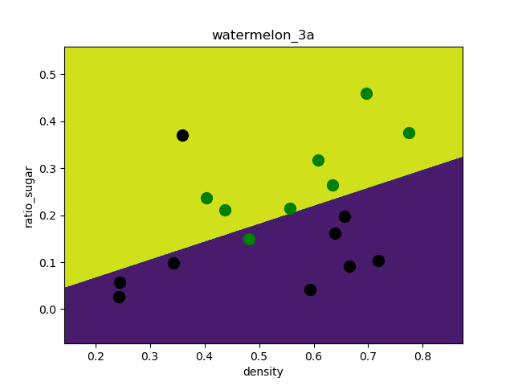
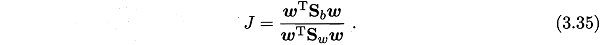
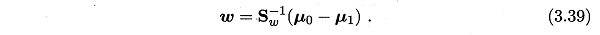
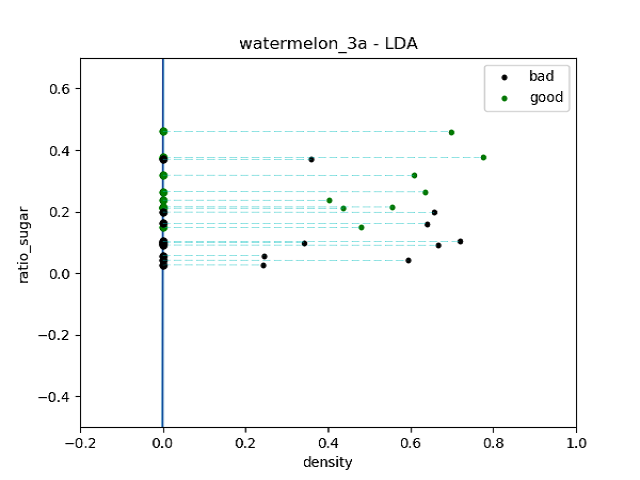
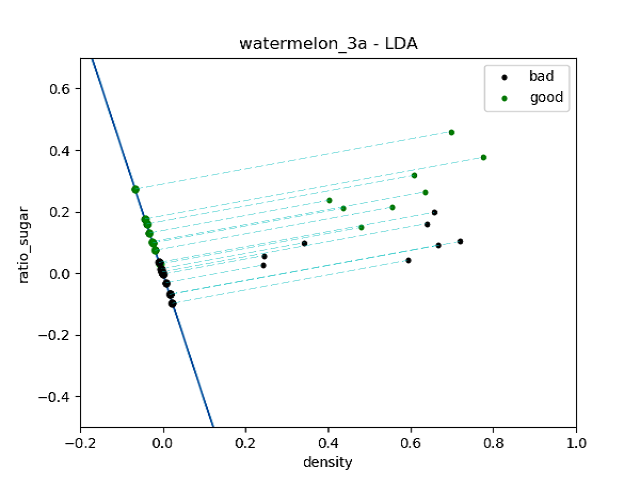

本系列主要采用**Python-sklearn**实现，环境搭建可参考[ 数据挖掘入门：Python开发环境搭建（eclipse-pydev模式）](http://blog.csdn.net/snoopy_yuan/article/details/61211639).

相关答案和源代码托管在我的Github上：[PY131/Machine-Learning_ZhouZhihua](https://github.com/PY131/Machine-Learning_ZhouZhihua).

### 3.5 编程实现线性判别分析（LDA） ###
> 

本题采用题3.3中的西瓜数据集如下图示：

> 

这里采用基于**sklearn**和**自己编程实现**两种方式实现线性判别分析（[查看完整代码](https://github.com/PY131/Machine-Learning_ZhouZhihua/tree/master/ch3_linear_model/3.5_LDA)）。

关于数据集的介绍：

具体过程如下：

#### 1. 数据导入、可视化、预分析： ####

可以参照[周志华《机器学习》课后习题解答系列（四）：Ch3.3 - 编程实现对率回归](http://blog.csdn.net/snoopy_yuan/article/details/63684219)中的第一步。

#### 2. 采用sklean得到线性判别分析模型： ####

采用sklearn.discriminant_analysis.LinearDiscriminantAnalysis直接实现基础的LDA，通过分割数据集，在训练集上训练数据，在预测集上度量模型优劣。

给出样例代码如下：

	from sklearn import model_selection
	from sklearn.discriminant_analysis import LinearDiscriminantAnalysis
	from sklearn import metrics
	import matplotlib.pyplot as plt
	
	# generalization of train and test set
	X_train, X_test, y_train, y_test = model_selection.train_test_split(X, y, test_size=0.5, random_state=0)
	
	# model fitting
	lda_model = LinearDiscriminantAnalysis(solver='lsqr', shrinkage=None).fit(X, y)
	
	# model validation
	y_pred = lda_model.predict(X_test)
	
	# summarize the fit of the model
	print(metrics.confusion_matrix(y_test, y_pred))
	print(metrics.classification_report(y_test, y_pred))

得出的混淆矩阵及相关度量结果如下：

	[[4 1]
	 [1 3]]
	             precision    recall  f1-score   support
	
	        0.0       0.80      0.80      0.80         5
	        1.0       0.75      0.75      0.75         4
	
	avg / total       0.78      0.78      0.78         9

可以看出，由于数据集的散度不太明显，得出的类别判断存在较大误差。总体来看，这里的线性判别分类器与3.3题的对率回归性能相当（accuracy≈0.78）。

基于matplotlib绘制出LDA的分类区域如下图示：

> 

可以看出，由于数据集的散度不太明显，决策边界存在较大误差。

#### 3. 自己编程实现线性判别分析： ####

关于LDA的原理及参数求解，可参考书上p61、62。所谓线性判别。类似PCA，LDA可将较高维数据投影到较低维空间上，分析其降维后的数据特征的类别区分情况。

这里采用西瓜数据集，包含2个属性（特征），一个类标签（二分类0、1）。在此上运用LDA，即是要找到最优直线，映射到直线上的数据特征类分明显。

如何区分类别呢？采用类内散度（within-class scatter）最小化，类间散度（between-class scatter）最大化，关于散度的定义参考书中p61式(3.33)和(3.34)。

优化目标为最大化下式（Sw-类内散度，Sb-类间散度，w-直线方向向量）：

> 

我们的目的是最大化上面的式子，根据书中推导，最优解（直线参数）如下式：

> 

相关详细过程参考树p61-62页。

- 编程：根据式3.39计算w：

样例代码如下：

	# computing the d-dimensional mean vectors
	import numpy as np
	
	# 1-st. get the mean vector of each class
	u = []  
	for i in range(2): # two class
	    u.append(np.mean(X[y==i], axis=0))  # column mean
	
	# 2-nd. computing the within-class scatter matrix, refer on book (3.33)
	m,n = np.shape(X)
	Sw = np.zeros((n,n))
	for i in range(m):
	    x_tmp = X[i].reshape(n,1)  # row -> cloumn vector
	    if y[i] == 0: u_tmp = u[0].reshape(n,1)
	    if y[i] == 1: u_tmp = u[1].reshape(n,1)
	    Sw += np.dot( x_tmp - u_tmp, (x_tmp - u_tmp).T )
	
	# 3-th. computing the parameter w, refer on book (3.39)
	w = np.dot( Sw**-1, (u[0] - u[1]).reshape(n,1) )  # here we use a**-1 to get the inverse of a ndarray

- 绘制LDA直线并作数据点投影来查看类簇情况：

通过绘制投影的方式，可视化西瓜数据在LDA直线上类簇情况（[查看相关代码](https://github.com/PY131/Machine-Learning_ZhouZhihua/tree/master/ch3_linear_model/3.5_LDA)），如下图示：

> 

从上图看出，由于数据线性不可分，则出现类簇重叠现象。接下来，通过观查数据，我们考虑将西瓜数据集中的bad类离群点15删去（即图中左上的黑点）此时数据集的线性可分性大大提高。

然后再次采用LDA进行映射，得到结果图如下：

> 

可以看出，在数据集变得线性可分时，二维点到一维LDA直线的投影出现明显的分类，此时LDA分类器效果很好。

综上所述，由于西瓜数据集自身非线性因素，LDA所得直线未能很好的表现出类别的分簇情景，说明，**LDA基本模型不太适用于线性不可分**的情况。要拓展到非线性，或许可以考虑**SVM-核技巧**。

----

本文的重要列出索引如下：

- [LDA详细介绍及其本质剖析](http://sebastianraschka.com/Articles/2014_python_lda.html)
- [sklearn官网 - LDA for classfication](http://scikit-learn.org/stable/auto_examples/classification/plot_lda.html#sphx-glr-auto-examples-classification-plot-lda-py)