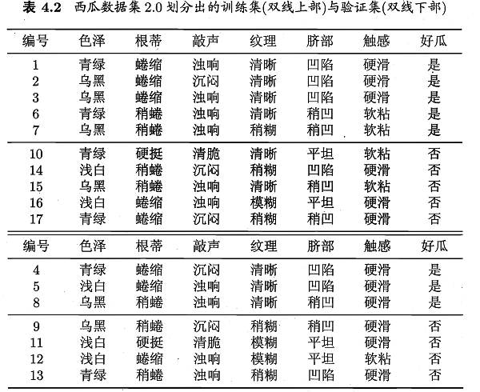
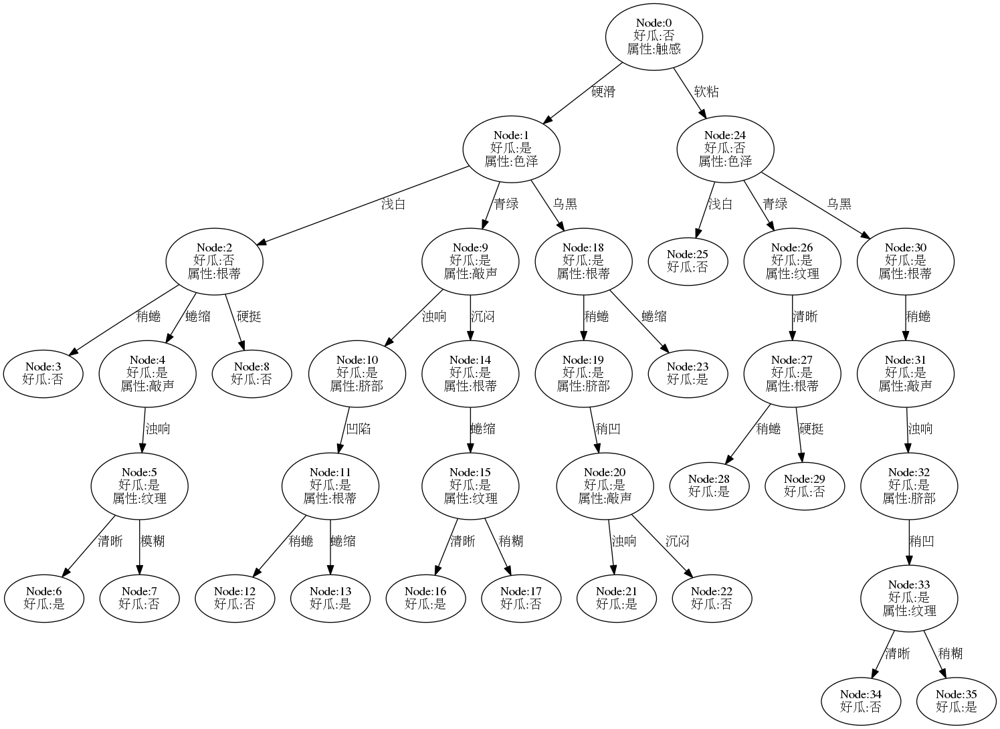
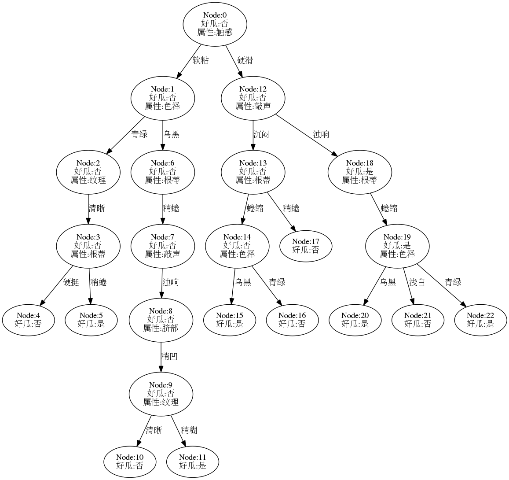
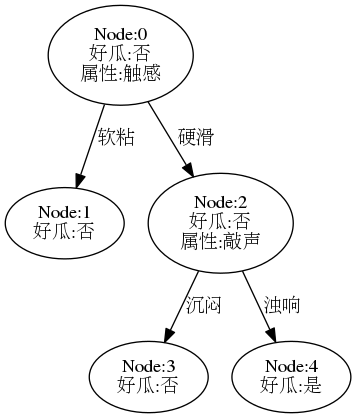

这里采用**Python-sklearn**的方式，环境搭建可参考[ 数据挖掘入门：Python开发环境搭建（eclipse-pydev模式）](http://blog.csdn.net/snoopy_yuan/article/details/61211639).

相关答案和源代码托管在我的Github上：[PY131/Machine-Learning_ZhouZhihua](https://github.com/PY131/Machine-Learning_ZhouZhihua).

## 4.6 编程实现CART算法与剪枝操作 ##

> 
> 

 - 决策树基于训练集完全构建易陷入**过拟合**。为提升泛化能力。通常需要对决策树进行**剪枝**。

 - 原始的CART算法采用**基尼指数**作为最优属性划分选择标准。

编码基于Python实现，详细解答和编码过程如下：（[查看完整代码和数据集](https://github.com/PY131/Machine-Learning_ZhouZhihua/tree/master/ch4_decision_tree/4.4_CART)）：

### 1.最优划分属性选择 - 基尼指数 ###

同信息熵类似，**基尼指数（Gini index）**也常用以度量**数据纯度**，一般基尼值越小，数据纯度越高，相关内容可参考书p79，最典型的相关决策树生成算法是**CART算法**。

下面是某属性下数据的基尼指数计算代码样例（连续和离散的不同操作）：

	def GiniIndex(df, attr_id):
	    '''
	    calculating the gini index of an attribution
	     
	    @param df:      dataframe, the pandas dataframe of the data_set
	    @param attr_id: the target attribution in df
	    @return gini_index: the gini index of current attribution
	    @return div_value: for discrete variable, value = 0
	                   for continuous variable, value = t (the division value)
	    '''  
	    gini_index = 0  # info_gain for the whole label
	    div_value = 0  # div_value for continuous attribute
	    
	    n = len(df[attr_id])  # the number of sample
	    
	    # 1.for continuous variable using method of bisection
	    if df[attr_id].dtype == (float, int):
	        sub_gini = {}  # store the div_value (div) and it's subset gini value
	        
	        df = df.sort([attr_id], ascending=1)  # sorting via column
	        df = df.reset_index(drop=True)
	        
	        data_arr = df[attr_id]
	        label_arr = df[df.columns[-1]]
	        
	        for i in range(n-1):
	            div = (data_arr[i] + data_arr[i+1]) / 2
	            sub_gini[div] = ( (i+1) * Gini(label_arr[0:i+1]) / n ) \
	                              + ( (n-i-1) * Gini(label_arr[i+1:-1]) / n )
	        # our goal is to get the min subset entropy sum and it's divide value
	        div_value, gini_index = min(sub_gini.items(), key=lambda x: x[1])
	        
	    # 2.for discrete variable (categoric variable)
	    else:
	        data_arr = df[attr_id]
	        label_arr = df[df.columns[-1]]
	        value_count = ValueCount(data_arr)
	            
	        for key in value_count:
	            key_label_arr = label_arr[data_arr == key]
	            gini_index += value_count[key] * Gini(key_label_arr) / n
	    
	    return gini_index, div_value

----

### 2.完全决策树生成 ###

下图是基于基尼指数进行最优划分属性选择，然后在数据集watermelon-2.0全集上递归生成的完全决策树。(基础算法和流程可参考[题4.3](http://blog.csdn.net/snoopy_yuan/article/details/68959025)，或[查看完整代码](https://github.com/PY131/Machine-Learning_ZhouZhihua/blob/master/ch4_decision_tree/4.4_CART/src/decision_tree.py)）

----

### 3.剪枝操作 ###

参考书4.3节（p79-83），**剪枝**是提高决策树模型泛化能力的重要手段，一般将剪枝操作分为**预剪枝、后剪枝**两种方式，简要说明如下：

| 剪枝类型 | 搜索方向 | 方法开销 | 结果树的大小 | 拟合风险 | 泛化能力 |
|--|--|--|--|--|--|
| 预剪枝（prepruning） | 自顶向下 | 小（与建树同时进行） | 很小 | 存在欠拟合风险 | 较强 |
| 后剪枝（postpruning） | 自底向上 | 较大（决策树已建好） | 较小 |  | 很强 |

基于训练集与测试集的划分，编程实现预剪枝与后剪枝操作：

#### 3.1 完全决策树 ####

下图是基于训练集生成的完全决策树模型，可以看到，在有限的数据集下，树的结构过于复杂，模型的泛化能力应该很差：

此时在测试集（验证集）上进行预测，精度结果如下：

	accuracy of full tree: 0.571

#### 3.2 预剪枝 ####

参考书p81，采用预剪枝生成决策树，[查看相关代码](https://github.com/PY131/Machine-Learning_ZhouZhihua/blob/master/ch4_decision_tree/4.4_CART/src/decision_tree.py)， 结果树如下：

现在的决策树退化成了单个节点，（比决策树桩还要简单），其测试精度为：

	accuracy of pre-pruning tree: 0.571

此精度与完全决策树相同。进一步分析如下：
 
- 基于**奥卡姆剃刀**准则，这棵决策树模型要优于前者；
- 由于数据集小，所以预剪枝优越性不明显，实际预剪枝操作是有较好的模型提升效果的。
- 此处结果模型太简单，有严重的**欠拟合风险**。

#### 3.3 后剪枝 ####

参考书p83-84 ，采用后剪枝生成决策树，[查看相关代码](https://github.com/PY131/Machine-Learning_ZhouZhihua/blob/master/ch4_decision_tree/4.4_CART/src/decision_tree.py)，结果树如下：

决策树相较完全决策树有了很大的简化，其测试精度为：

	accuracy of post-pruning tree: 0.714

此精度相较于前者有了很大的提升，说明经过后剪枝，模型**泛化能力**变强，同时保留了一定树规模，**拟合**较好。

### 4.总结 ###

 - 由于本题数据集较差，决策树的总体表现一般，交叉验证存在很大波动性。
 - 剪枝操作是提升模型泛化能力的重要途径，在不考虑建模开销的情况下，后剪枝一般会优于预剪枝。
 - 除剪枝外，常采用最大叶深度约束等方法来保持决策树泛化能力。

----

