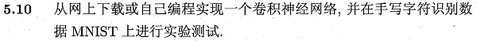
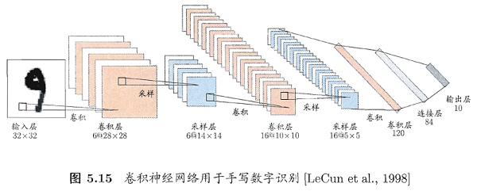
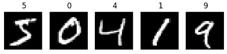
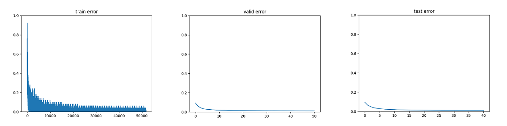
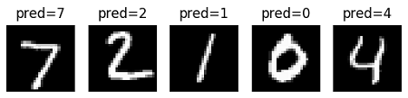

本系列相关答案和源代码托管在我的Github上：[PY131/Machine-Learning_ZhouZhihua](https://github.com/PY131/Machine-Learning_ZhouZhihua).

# 卷积神经网络实验 - 手写字符识别 #

> 

注：本题程实现基于python-theano（这里查看[完整代码](https://github.com/PY131/Machine-Learning_ZhouZhihua/tree/master/ch5_neural_networks/5.10_CNN)和[数据集](http://www-labs.iro.umontreal.ca/~lisa/deep/data/mnist/)）。

## 1. 基础知识回顾 ##

### 1.1. 核心思想 ###

卷积神经网络（Convolutional Neural Network, CNN）是“**深度学习**”的代表模型之一，是一种**多隐层**神经网络，正被广泛用于图像处理、语音识别等热点领域。

卷积神经网络的原理和特点，集中体现在以下三个核心思想当中：

 - **局部感受野**（Local Receptive Fields）
 - **权值共享**（weight sharing）
 - 时间或空间的**亚采样**

在整合了上述三大特点之后，卷积神经网络具备了很强的**畸变容忍能力**，能够从复杂的对象中**隐式地**进行**特征提取与学习**。  

### 1.2. 结构和功能 ###

卷积神经网络同多层感知机（MLP）一样，通过设置多个隐层来实现对复杂模型的学习。如下图所示是一个手写字符识别的卷积神经网络结构示意图（书p114）：



从图中可以看到卷积层（convolutional layer）和采样层（pooling layer）的复合，其功能简述如下：

 - 卷积层包含多个**特征映射**（feature map），它们采用相应的**卷积滤波器**从输入中提取特征；
 - 采样层基于**局部相关性**原理对卷积层进行**亚采样**，从而在保留有用信息的同时减少数据量；

通过多层复合，隐层最终输出目标维**特征向量**，通过连接层和输出层输出结果。

### 1.3. 参数技巧 ###

神经网络的参数设计十分重要，关于CNN模型的一些参数的考虑（如隐层特征图数目和大小、滤波器大小等），可参考[Convolutional Neural Networks (LeNet)](http://deeplearning.net/tutorial/lenet.html#lenet)文章最后**Tips and Tricks**的内容。

## 2. 手写字符识别实验 ##

这里，我们采用**python-theano深度学习库**来实现基于[MNIST](http://yann.lecun.com/exdb/mnist/)数据的字符识别实验。关于theano的基础使用可参考：[深度学习基础 - 基于Theano-MLP的字符识别实验（MNIST）](http://blog.csdn.net/snoopy_yuan/article/details/71548243)或是[Deep Learning Tutorials](http://deeplearning.net/tutorial/)。

### 2.1. 数据获取及预处理 ###

这里我们采用经过规约的数据集[mnist.pkl.gz](http://www-labs.iro.umontreal.ca/~lisa/deep/data/mnist/),给出该数据集的部分信息如下：

- **维度属性**：数据集包含3个子数据集，对应train_set、valid_set、test_set，样本规模分别为50000、10000、10000；每条样本包含：输入向量[1\*784]，对应输入图片灰度矩阵[28\*28]；输出值，对应图片类别标签(数字0-9)；
- **完整度**：样本完整；
- **平衡度**：未知；
- **更多信息**：手写字符所覆盖的灰度已被人工调整到了图片的中部。

下面是一些样例图片：



通过对数据集的分析，确定此处该数据集已无需额外的预处理即可使用，只是在使用时注意维度变换即可。

### 2.2. 基于theano实现网络模型 ###

基于theano来训练一个卷积神经网络需要完成的内容包括：

 1. **参数初始化**，采用`theano.shared`来达到权值共享，基于数据信息设计相关参数（隐层规模、滤波器大小、学习率、迭代次数限、若采样MSGD算法还需设置mini-batch大小等）；
 2. 相关**辅助函数**，如采用`theano.function`实现tanh/sigmoid、似然损失函数等；
 3. **卷积**操作（Convolution）和**池化**操作（pooling），采用`theano.tensor.signal.conv2d`实现二维（2D）卷积；采用`theano.tensor.signal.pool.pool_2d`实现最大池化（max-pooling），
 4. 训练**过程优化机制**，如加入不同时间尺度的验证、测试机制，早停机制；
 5. 实现迭代训练程序并得出模型（即最优参数）；

进一步地：
 
 - 将卷积层与池化层（采样层）整个为一个复合层，称为**卷积-池化层**（`class LeNetConvPoolLayer`）；
 - 将模型的训练、验证、测试整合在一个程序块中，方便早停判断；

这里还需进一步说明各层规模和滤波器大小的设置：

以当前样本为例，输入层大小`[28*28]`，若采用`5*5`的滤波器进行卷积，则第一个卷积层的特征图大小为`[24*24]`（ps. 28-5+1=24），若紧接着的亚采样模版大小为`[2*2]`，那么该池化层特征图大小为`[12*12]`（ps. 24/2=12）。同理，可计算出下一个卷积池化的特征图大小为`[8*8]`和`[4*4]`，再往后就只需要一个面向连接层的一维卷积层了，其节点数为当前的`feature maps`数。然后按照MLP模型给出连接层和输出层即可。

各层规模设置的样例程序如下：
	
	```python
    layer1 = LeNetConvPoolLayer(
        rng,
        input=layer0.output,
        image_shape=(batch_size, nkerns[0], 12, 12),
        filter_shape=(nkerns[1], nkerns[0], 5, 5),
        poolsize=(2, 2)
    )    

    layer2_input = layer1.output.flatten(2)

    # construct a fully-connected sigmoidal layer
    layer2 = HiddenLayer(
        rng,
        input=layer2_input,
        n_in=nkerns[1] * 4 * 4,
        n_out=500,
        activation=T.tanh
    )

    # classify the values of the fully-connected sigmoidal layer
    layer3 = LogisticRegression(input=layer2.output, n_in=500, n_out=10)
	```

给出该训练程序简化样例如下[查看完整程序](https://github.com/PY131/Machine-Learning_ZhouZhihua/blob/master/ch5_neural_networks/5.10_CNN/Mnist_CNN.py)：
	
	```python
	def evaluate_lenet5(learning_rate=0.1,      # 学习率
	                    n_epochs=200,           # 迭代批数
	                    dataset='mnist.pkl.gz', # 数据集文件
	                    nkerns=[20, 50],        # 每隐层特征图数目序列
	                    batch_size=500):        # mini-batch大小（for MSGD）
	    
	    # 加载数据，生成训练集/验证集/测试集
	    datasets = load_data(dataset)
	    
	    train_set_x, train_set_y = datasets[0]
	    valid_set_x, valid_set_y = datasets[1]
	    test_set_x,  test_set_y  = datasets[2]
		...
		# 搭建模型网络结构（包括上面的隐层sizes推导）

		# 输入
	    layer0_input = x.reshape((batch_size, 1, 28, 28))

		# 第一层 - 复合
	    layer0 = LeNetConvPoolLayer(
	        rng,
	        input=layer0_input,
	        image_shape=(batch_size, 1, 28, 28),
	        filter_shape=(nkerns[0], 1, 5, 5),
	        poolsize=(2, 2)
	    )
	    
		# 第二层 - 复合
	    layer1 = LeNetConvPoolLayer( ... ) 

		# 第三层 - 隐层   
	    layer2_input = layer1.output.flatten(2)
	    layer2 = HiddenLayer( ... )

		# 全连接输出   
	    layer3 = LogisticRegression(input=layer2.output, n_in=500, n_out=10)
	
	    # 似然损失函数
	    cost = layer3.negative_log_likelihood(y)
		...
	    # 参数更新机制
	    updates = [
	        (param_i, param_i - learning_rate * grad_i)
	        for param_i, grad_i in zip(params, grads)
	    ]
	
		# 模型训练函数体
	    train_model = theano.function(
	        [index],
	        cost,
	        updates=updates,
	        givens={
	            x: train_set_x[index * batch_size: (index + 1) * batch_size],
	            y: train_set_y[index * batch_size: (index + 1) * batch_size]
	        }
	    )
	    
	    ########## 模型训练 ##########

		# 早停机制设置
	    patience = 10000  # 迭代次数耐心上限
	    patience_increase = 2  # 耐心上限拓展步长
	    improvement_threshold = 0.995  # 精度明显提升判断

		# 验证周期
	    validation_frequency = min(n_train_batches, patience // 2)
		...    
		# 循环
	    while (epoch < n_epochs) and (not done_looping):
	        epoch = epoch + 1

			# mini-batch迭代
	        for minibatch_index in range(n_train_batches):
				...
				# 模型训练（损失计算+参数更新）
            	cost_ij = train_model(minibatch_index)

				# 模型验证（a batch训练完成）
	            if (iter + 1) % validation_frequency == 0:

	                # 计算0-1损失 - 验证误差
	                validation_losses = [validate_model(i) for i in range(n_valid_batches)]
	                this_validation_loss = numpy.mean(validation_losses)
					...
	
	                # 如果取得更好模型（验证精度提升）
	                if this_validation_loss < best_validation_loss:
						# 若精度提升明显，但耐心迭代次数上限达到，则提高迭代次数上限
	                    if this_validation_loss < best_validation_loss * improvement_threshold:
	                        patience = max(patience, iter * patience_increase)
						...

						# 进行测试（在验证精度提升时）以方便我们对比观测
	                    test_losses = [
	                        test_model(i)
	                        for i in range(n_test_batches)
	                    ]
	                    test_score = numpy.mean(test_losses)
						...
	
				# 早停判断
	            if patience <= iter:
	                done_looping = True
	                break
	    	...
		#返回所需信息
	
	```

### 2.3. 训练及测试结果 ###

这里采用MSGD（块随机梯度下降法）进行迭代寻优，下图是经过大约5万次迭代训练后得到的三种误差（训练/验证/测试）收敛曲线，可以看出其过程收敛性：



显示出一些测试样本的预测结果如下图示：



最终的运行结果打印如下:

	# 最优验证误差结果
	Best validation score of 1.080000 %
	# 测试误差结果
	Test performance 1.030000 %
	# 过程时耗
	The code for file Mnist_CNN.py ran for 90.23m

从这里的结果可以看出：一方面，卷积神经网络训练**计算规模庞大**（当前软硬件环境下耗时一个半小时，）；另一方面，得到的**模型精度很高**（在测试集上实现了约99%的精度，这基本意味着MNIST问题得到了解决）。

## 3. 总结 ##

通过该实验，我们注意到：

 - CNN是一种**优秀**的机器学习模型，能够实现较困难的学习任务；
 - 以CNN为代表的“深度学习”模型的训练往往面临着**巨大的计算量**，为优化实现，一方面需要提升软硬件配置环境，另一方面要**合理设计训练机制**，包括MSGD、早停、正则化等辅助方法的合理运用；
 - **参数设置**合理与否严重影响模型的训练效率和实现效果；

通过该实验，我们回顾了**卷积神经网络**及其所代表的**深度学习**概念，练习了基于**python-theano计算框架**下的机器学习建模方法，为进一步的学习研究积累的实践经验。

## 4. 参考 ##

下面列出相关参考：

 - 本文直接教程：[深度学习基础 - 基于Theano-MLP的字符识别实验（MNIST）](http://blog.csdn.net/snoopy_yuan/article/details/71548243)
 - 本文直接教程：[Convolutional Neural Networks (LeNet)](http://deeplearning.net/tutorial/lenet.html)
 - 一个有趣的可视化网站：[“CNN-数字识别”模型可视化](http://scs.ryerson.ca/~aharley/vis/conv/)
 - 一个深度学习主页：[Contents - DeepLearning 0.1 documentation](http://deeplearning.net/tutorial/contents.html)