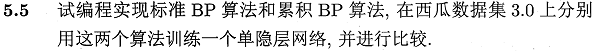
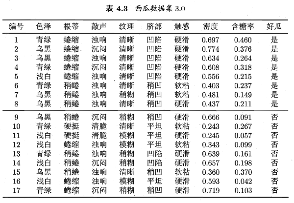

这里的编程基于**Python-PyBrain**。Pybrain是一个以神经网络为核心的机器学习包，相关内容可参考[神经网络基础 - PyBrain机器学习包的使用](http://blog.csdn.net/snoopy_yuan/article/details/70170706)

相关答案和源代码托管在我的Github上：[PY131/Machine-Learning_ZhouZhihua](https://github.com/PY131/Machine-Learning_ZhouZhihua).

## 5.5 编程实现BP算法 ##

> 
> 

编码基于Python实现，整个实验过程如下：（[这里查看完整代码和数据集](https://github.com/PY131/Machine-Learning_ZhouZhihua/blob/master/Ch5_neural_network/5.5_BP/src/BP_network.py)）：

step 1.基于**PyBrain**分别实现标准BP和累积BP两种算法下的BP网络训练，并进行比较；

### 1.算法分析 ###

参考书上推导及**算法图5.8**，首先给出BP算法的两种版本示意如下：

	Algorithms 1. 标准BP算法
	----
		输入： 训练集 D，学习率 η.
		过程： 
			1. 随即初始化连接权与阈值 (ω，θ).
			2. Repeat：
			3.   for x_k，y_k in D:
			4.     根据当前参数计算出样本误差 E_k.
			5.     根据公式计算出随机梯度项 g_k.
			6.     根据公式更新 (ω，θ).
			7.   end for
			8. until 达到停止条件
		输出：(ω，θ) - 即相应的多层前馈神经网络.
	----

	Algorithms 2. 累积BP算法
	----
		输入： 训练集 D，学习率 η，迭代次数 n.
		过程： 
			1. 随即初始化连接权与阈值 (ω，θ).
			2. Repeat：
			3.     根据当前参数计算出累积误差 E.
			4.     根据公式计算出标准梯度项 g.
			5.     根据公式更新 (ω，θ).
			6.     n = n-1
			7. until n=0 or 达到停止条件
		输出：(ω，θ) - 即相应的多层前馈神经网络.
	----

可以看出，两种算法的本质区别类似于**随机梯度下降法**与**标准梯度下降法**的区别。pybrain包为我们实现这两种不同的算法提供了方便。我们只需要修改 pybrain.supervised.trainers 的初始化参数（如learningrate、batchlearning）并设置数据集遍历次数 trainEpochs() 即可。

### 2.数据预处理 ###

从表4.3的西瓜数据集3.0可以看到，样本共有8个属性变量和一个输出变量。其中既有标称变量（色泽~触感、好瓜），也有连续变量（密度、含糖率）。

为了方便进行神经网络模型的搭建（主要是为对离散值进行数值计算），首先考虑对标称变量进行数值编码，这里我们采用pandas.get_dummies()函数进行输入的**独热编码**（转化为**哑变量的形式**），采用pybrain.datasets.ClassificationDataSet的_convertToOneOfMany()进行输出的独热编码。关于独热编码
原理可参考[One-hot_Wikipedia](https://en.wikipedia.org/wiki/One-hot)或[数据预处理之独热编码（One-Hot Encoding）](http://blog.sina.com.cn/s/blog_5252f6ca0102uy47.html)

对“西瓜数据集3.0”进行独热编码：

编码前：

	编号  色泽  根蒂  敲声  纹理  脐部  触感     密度    含糖率 好瓜
	0    1  青绿  蜷缩  浊响  清晰  凹陷  硬滑  0.697  0.460  是
	1    2  乌黑  蜷缩  沉闷  清晰  凹陷  硬滑  0.774  0.376  是
	2    3  乌黑  蜷缩  浊响  清晰  凹陷  硬滑  0.634  0.264  是
	...

此时数据集大小[17,10]，8输入，1输出。

编码后：

	编号     密度    含糖率  色泽_乌黑  色泽_浅白  色泽_青绿  根蒂_硬挺  根蒂_稍蜷  根蒂_蜷缩  敲声_沉闷  ...   \
	0    1  0.697  0.460      0      0      1      0      0      1      0  ...    
	1    2  0.774  0.376      1      0      0      0      0      1      1  ...    
	2    3  0.634  0.264      1      0      0      0      0      1      0  ...   
	...	

	纹理_模糊  纹理_清晰  纹理_稍糊  脐部_凹陷  脐部_平坦  脐部_稍凹  触感_硬滑  触感_软粘  好瓜_否  好瓜_是  
	0       0      1      0      1      0      0      1      0     0     1  
	1       0      1      0      1      0      0      1      0     0     1  
	2       0      1      0      1      0      0      1      0     0     1  
	...

此时数据集大小[17,22]，19输入，2输出。


### 3.模型训练与测试 ###

根据上面的数据，搭建一个19输入，2输出的**前向反馈神经网络**（BP network）。然后划分训练集与测试集，进行建模与验证实验。

实现说明，在pybrain中：splitWithProportion函数可直接划分数据；buildNetwork函数可用于搭建BP神经网络；BackpropTrainer用于生成训练模版并可基于此进行训练，改变相关参数可分别实现标准BP算法和累积BP算法；

1. 生成模型，pybrain默认的是Sigmoid激活函数，其非常适用于二分类，另外还有一种激活函数十分适用于多分类（包括二分类），即[Softmax function](https://en.wikipedia.org/wiki/Softmax_function)。这里我们将输出进行了独热编码， 因此考虑采用Softmax作为输出层的激活函数，然后采用**胜者通吃**（winner-takes-all）法则确定分类结果。

	模型生成样例代码：
	
		```python
		n_h = 5 # hidden layer nodes number
		net = buildNetwork(19, n_h, 2, outclass = SoftmaxLayer)
		```

2. 标准BP算法学习神经网络：

	样例代码：
	
		```python
		trainer = BackpropTrainer(net, trndata)
		trainer.trainEpochs(1)
		```

3. 累积BP算法学习神经网络样例代码（50次迭代）：

	样例代码：

		```python
		trainer = BackpropTrainer(net, trndata, batchlearning=True)
		trainer.trainEpochs(50) 
		```

	此外还可以绘制出累积BP算法参数学习过程的收敛曲线，[查看详细代码](https://github.com/PY131/Machine-Learning_ZhouZhihua/blob/master/Ch5_neural_network/5.5_BP/src/BP_network.py)：

4. 两种算法比较：

	上述两种BP算法实现的代码区别可参考[PyBrain官网: trainers – - Supervised Training for Networks and other Modules](http://pybrain.org/docs/api/supervised/trainers.html?highlight=testonclassdata#pybrain.supervised.trainers.BackpropTrainer.testOnClassData)

	进行一次训练，然后基于测试集预测，得出两种方法的预测精度如下：
	
		标准BP算法： epoch:    1  test error: 50.00%
		累积BP算法：	epoch:   50  test error: 25.00%
	
	可以看出，本次实验累积BP算法优于前者，但一次实验说服力不够，于是我们进行多次实验得出预测结果平均精度比较如下：

		标准BP算法：
		25.00%  75.00%  75.00%  75.00%  50.00%  50.00% ... 
		average error rate: 47.50%

		累积BP算法：
		25.00%  75.00%  50.00%  50.00%  25.00%  50.00% ...
		average error rate: 38.75%
	
	从结果可以看出，累积BP算法精度总体还是优于标准BP算法。但在实验过程中我们注意到，累积BP算法的运行时间远大于标准BP算法。

	进一步地，我们注意到，由于数据集限制（样本量太少），模型精度很差。


### 4.参考 ###

本文涉及到的一些重要参考如下：

 - [Pybrain官网](http://pybrain.org/docs/index.html)
 - [神经网络基础 - PyBrain机器学习包的使用](http://blog.csdn.net/snoopy_yuan/article/details/70170706)

----


