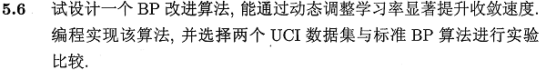
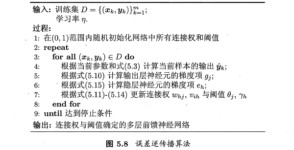
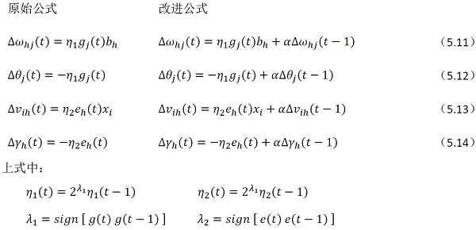
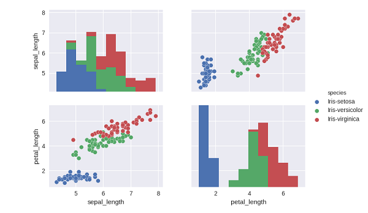
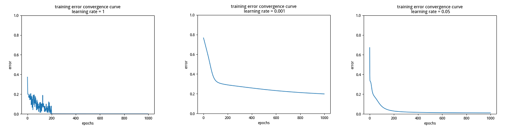
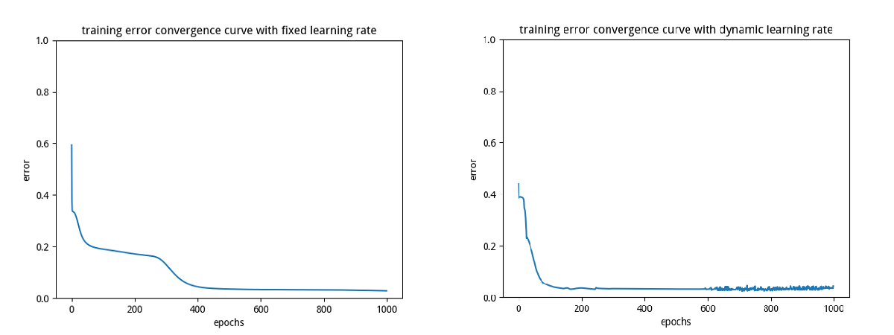

相关答案和源代码托管在我的Github上：[PY131/Machine-Learning_ZhouZhihua](https://github.com/PY131/Machine-Learning_ZhouZhihua).

## 5.6 BP算法改进 ##

> 

注：本题程序基于Python实现（[这里查看完整代码和数据集](https://github.com/PY131/Machine-Learning_ZhouZhihua/tree/master/ch5_neural_networks/5.6_BP_improve)）。

### 1. 方法设计 ###

传统的BP算法改进主要有两类：

 - 启发式算法：如附加动量法，自适应算法。
 - 数值优化算法：如共轭梯度法、牛顿迭代法、Levenberg-Marquardt法。

这里我们首先采用**附加动量**实现基本的方法改进。然后分析算法的不足，设计面向学习率的自适应机制来改进，实现基于**动态自适应学习速率**的BP算法改进。

#### (1) 附加动量项 ####

这是一种广泛用于加速梯度下降法收敛的优化方法，其**核心思想**是：在梯度下降搜索时，若当前梯度下降与之前梯度下降方向相同，则加速搜索，反之则减速搜索。

参考书p103（式5.11），标准BP算法的参数更新项为：

	∆ω(t) = ηg(t)

式中，∆ω(t)为第t次迭代的参数调整量，η为学习率，g(t)为第t次迭代所计算出的梯度。

在添加动量项之后，基于梯度下降的参数更新项为：

	∆ω(t) = η[(1-μ)g(t)+μg(t-1)]

始终，μ为**动量因子**（取值0~1）。上式也等效于：

	∆ω(t) = α∆ω(t-1)+ηg(t)

式中α被称为**遗忘因子**，α∆ω(t-1)代表之前梯度下降的方向和大小信息对当前梯度下降的调整作用。

#### (2) 自适应学习率 ####
	
附加动量法面临学习率的选取的困难，进而产生收敛速度与收敛性之间的矛盾。于是另考虑引入学习速率自适应设计，这里给出一种自适应方案：
	
	η(t) = σ(t)η(t-1)

上式中，σ(t)为第t次迭代时的**自适应学习速率因子**，下面是其一种计算实例：

	σ(t) = 2^λ
	其中λ为梯度方向：λ = sign(g(t)(t-1))

这样，学习率的变化可反映前面附加动量项中所说的“**核心思想**”。

#### (3) 算法总结 ####

将上述两种方法结合起来，形成**动态自适应学习率的BP改进算法**：

学习算法原型可参照书p104算法图5.8，如下图所示：



从上图及书中内容可知，输出层与隐层的梯度项不同，故而对应**不同的学习率** η_1 和 η_2，算法的修改主要是第7行关于参数更新的内容：

将附加动量项与学习率自适应计算代入，得出公式(5.11-5.14)的调整如下图所示：



### 2. 对比实验 ###

（[点击查看完整程序](https://github.com/PY131/Machine-Learning_ZhouZhihua/blob/master/ch5_neural_networks/5.6_BP_improve/BP_improve.py)）

这里我们采用[IRIS data set](http://archive.ics.uci.edu/ml/datasets/Iris)，实验基于python-pybrain实现，步骤如下：
	
	1. 搭建网络：搭建单隐层网络；
	2. 训练网络：分别采用学习率固定方案和动态调整方案来实现基于BP算法的模型训练；
	3. 结果比较：比较训练过程中的参数或误差收敛情况以及最终的模型预测结果；

BP算法实现代码可参考[神经网络基础 - Python编程实现标准BP算法](http://blog.csdn.net/snoopy_yuan/article/details/70765238)

#### (1) 数据预分析 ####

[iris（鸢尾花）数据集](http://archive.ics.uci.edu/ml/datasets/Iris)的一些基本信息如下（参考[iris.names](http://archive.ics.uci.edu/ml/machine-learning-databases/iris/iris.names)）：

	属性信息，4-输入（连续值），1-输出（标称值，3类）：
		Attribute Information:
		   1. sepal length in cm
		   2. sepal width in cm
		   3. petal length in cm
		   4. petal width in cm
		   5. class: 
		      -- Iris Setosa
		      -- Iris Versicolour
		      -- Iris Virginica

	样本规模（150条，均匀分3类）：
		Number of Instances: 150 (50 in each of three classes)

	有无缺失值（无）：
		Missing Attribute Values: None
	...

经过相关预检，可以看出该数据集规整度很高。

对其中的一些变量进行可视化如下图，可以看出其类别分散特性：



为了方便进行数值计算，采用**独热编码（onehot encoding）**对输出的标称数据进行数值化，这样输出由1维变为3维（每一个输出对应一类）。在最终结果处理时，可采用**胜者通吃（winner-take-all）**的准则选择数值最大的输出对应的类作为分类结果。

#### (2) BP网络搭建 ####

这里搭建单隐层前馈模型，三层节点数从输入到输出依次为 <4, n_h, 3>，其中隐层节点数 n_h 根据实验具体进展灵活取值。

下面是BP网络搭建样例代码：

```python
	from BP_network import *
	bpn1 = BP_network()  # initial a BP network class
	bpn1.CreateNN(4, 5, 3, actfun = 'Sigmoid', learningrate = 0.02)  # build the network
```

#### (3) 固定学习率下的模型训练 ####

为了研究学习率对模型训练的影响，这里分别设置三个学习率：很大、很小和合适，分别得出对应训练误差曲线如下图所示：



分析上面的图，可以看出，当学习率过大时，收敛过程出现了严重的振荡，当学习率过小时，收敛过慢，当采用合适的学习率时，收敛过程稳定。

#### (4) 自适应学习率下的模型训练 ####

根据上面关于学习率过大过小的对比实验，这里先为学习率的调整设置上下限。然后实现动态学习率下的标准BP算法。

最后得出固定学习率与动态学习率下训练误差收敛曲线对比如下图：



可以看出，动态学习率的收敛速度较快，两种机制在足够多的迭代步骤后均实现了良好的精度。（另外我们看到，动态调整学习率下的收敛曲线最后阶段发生了轻微振荡，这和学习率的调整幅度（底数及遗忘系数有关系。这两个参数需要人工调试）有关）。

下面是最终的测试集预测误差结果：

	固定学习率：test error rate: 0.013
	动态学习率：test error rate: 0.027

### 3. 小结 ###

采用动态调整学习率的确能够大幅提升BP算法的收敛速度，在数据量很大时愈发明显。但同时也要注意学习率的取值区间和相关加速参数的设置，以期实现最优性能。