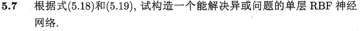
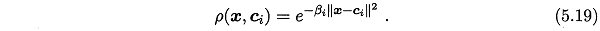
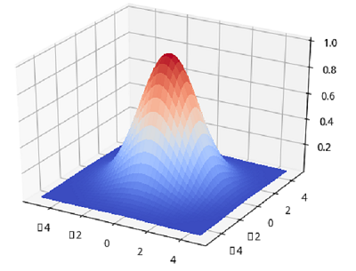
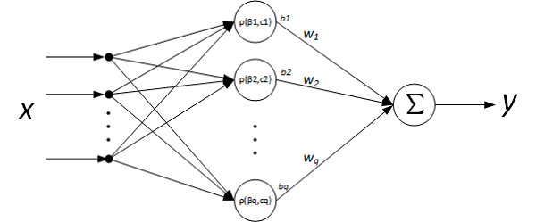
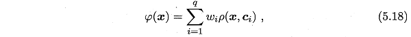
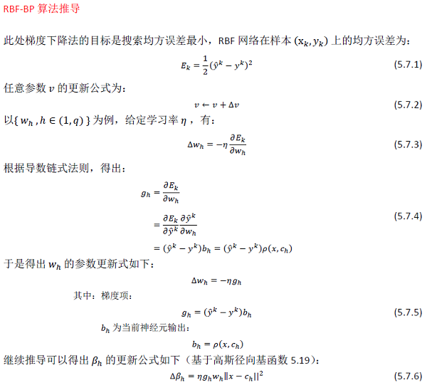
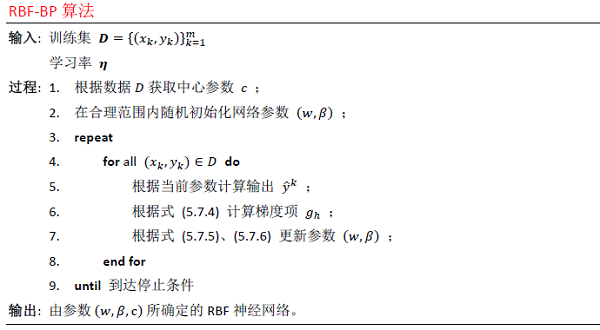

相关答案和源代码托管在我的Github上：[PY131/Machine-Learning_ZhouZhihua](https://github.com/PY131/Machine-Learning_ZhouZhihua).

## RBF神经网络实验 ##

> 

注：本题程序基于Python实现（[这里查看完整代码和数据集](https://github.com/PY131/Machine-Learning_ZhouZhihua/tree/master/ch5_neural_networks/5.7_RBF_BP)）。

### 1. RBF网络基础 ###

RBF网络采用RBF（Radial Basis Function函数）作为隐层神经元激活函数，是一种局部逼近神经网络，下面先分析其激活函数RBF，然后分析RBF神经网络的结构。

#### 1.1. 径向基函数(RBF) ####

径向基函数是一类取值依赖样本于到中心点距离的函数，本题基于常用的**高斯径向基函数**（gaussian RBF）开展实验。下面是高斯径向基函数形式书p108式(5.19)：



这里的 β 为尺度系数， c_i 为中心点（维度由输入决定），函数的取值取决于样本 x 到中心点的距离（2-范数），该函数的参数为 (β, c_i)。

如下图示为高斯径向基函数示意图（[绘图程序](https://github.com/PY131/Machine-Learning_ZhouZhihua/blob/master/ch5_neural_networks/5.7_RBF_BP/draw_RBF.py)）：



#### 1.2. RBF网络 ####

RBF神经网络一般指一种单隐层前馈神经网络，它使用径向基函数作为隐层神经元激活函数，而输出是隐层输出的线性组合，网络结构示意如下：



参考书p108式(5.18)，该神经网络的输出为：



进一步分析，一般函数均可表示成一组基函数的线性组合，而RBF网络相当于用隐层神经元构建了这样一组基函数，由输出层进行线性组合，从而实现函数逼近的功能。

### 2. RBF网络实现 ###

[查看完整代码](https://github.com/PY131/Machine-Learning_ZhouZhihua/blob/master/ch5_neural_networks/5.7_RBF_BP/RBF_BP.py)

这里RBF神经网络建模的过程分一下两步：

	1. 确定神经元对应的高斯径向基函数中心 c ；
	2. 利用BP算法来训练剩余参数 w, β ；

下面依次讨论其实现：

#### 2.1. RBF中心获取 ####

RBF的中心参数 c 的获取方法有以下一些：

 - **从输入数据样本中抽取**，这就要求输入样本具有较好的代表性；
 - **自组织生成**，如**聚类**法生成，采用聚类中心来作为中心参数 c ，同时根据各中心的距离来初始化尺度系数 β ；

#### 2.2. RBF-BP算法推导 ####

参考[神经网络基础 - Python编程实现标准BP算法](http://blog.csdn.net/snoopy_yuan/article/details/70765238)，这里隐层激活函数为RBF，输出层神经元数为 1 ，激活函数为 y=f(x)=x 。

BP算法采用梯度下降法进行参数迭代更新，参考书p102-103，进行RBF-BP算法中基于梯度下降的参数更新推导如下：



在完成基础推导之后，给出**RBF网络的BP算法**如下所示：



#### 2.3. RBF-BP算法实现 ####

样例代码如下：

	```python
	def BackPropagateRBF(self, x, y):
	    '''
	    the implementation of special BP algorithm on one slide of sample for RBF network
	    @param x, y: array and float, input and output of the data sample
	    '''
	    
	    # dependent packages
	    import numpy as np 
	
	    # get current network output
	    self.y = self.Pred(x)
	    
	    # calculate the gradient for hidden layer 
	    g = np.zeros(self.h_n)
	    for h in range(self.h_n):
	        g[h] = (self.y - y) * self.b[h]    
	    
	    # updating the parameter
	    for h in range(self.h_n):
	        self.beta[h] += self.lr * g[h] * self.w[h] * np.linalg.norm(x-self.c[h],2)
	        self.w[h] -= self.lr * g[h]
	```

### 3. 异或问题实验 ###

[查看完整代码](https://github.com/PY131/Machine-Learning_ZhouZhihua/blob/master/ch5_neural_networks/5.7_RBF_BP/Test_XOR.py)

#### 3.1. 准备数据 ####

首先基于numpy.array生成异或数据，该数据为2输入，1输出，如下所示：

样例代码：

	```python
	# train set
	X_trn = np.random.randint(0,2,(100,2))
	y_trn = np.logical_xor(X_trn[:,0],X_trn[:,1])
	```

样例数据：

	>>> X_trn
	array([[0, 0],
	       [1, 1],
		   ...
	>>> y_trn
	array([False, False, ...

#### 3.2. 参数之-RBF中心点 ####

这里由于采用异或数据，其中心点可以简单设置如下：

	centers = np.array([[0,0],[0,1],[1,0],[1,1]])

同时取隐节点数目为4。

#### 3.3. 生成模型并训练 ####

样例代码如下：

	```python
	# construct the network
	rbf_nn = RBP_network()  # initial a BP network class
	rbf_nn.CreateNN(4, centers, learningrate=0.05)  # build the network structure
	
	# parameter training（这里迭代10次）
	for i in range(10): 
	    rbf_nn.TrainRBF(X_trn, y_trn)
	```

绘制出训练过程中的均方误差变化曲线如下图：


由上图可以看到，曲线收敛十分迅速，说明这里的RBF网络训练异或数据集十分轻松，这也和我们所生成的数据的完备无误有关。

#### 3.4. 测试模型 ####

按照训练集数据生成方法生成测试集数据，通过模型预测，得出结果如下：

	test error rate: 0.000

即测试错误率为0，可知我们的模型预测十分准确的，泛化性能优秀（主要得益于XOR预测模型对RBF网络来说太过简单）。

### 4. 小结 ###

回顾RBF网络工作原理，如参考书p108式(5.18)-(5.19)。RBF网络建模类似于非线性模型中的基函数建模，进一步，我们可将其与广义可加模型联系起来。RBF网络采用径向基函数作为单隐层激活函数（即核函数），又可将其与SVM with RBF kernel联系起来。

回顾RBF网络实现过程，我们或可将该方法视为一种半监督的学习方法，具体有：

 - step 1：无监督的学习，从数据中获取中心参数，常用聚类方法；
 - step 2：有监督的学习，基于数据训练参数，过程一般基于BP算法实现；

### 5. 参考 ###

下面列出一些参考内容：

 - 基础知识：[绝对经典RBF神经网络 - 百度文库](https://wenku.baidu.com/view/c61384dda58da0116c174946.html)
 - 进阶知识：[RBF神经网络和BP神经网络有什么区别 - 知乎](https://www.zhihu.com/question/44328472)
 - 可视化：[matplotlib绘制3D图 - matplotlib官网](http://matplotlib.org/1.4.3/mpl_toolkits/mplot3d/index.html#toolkit-mplot3d-index)
