查看相关答案和源代码，欢迎访问我的Github：[PY131/Machine-Learning_ZhouZhihua](https://github.com/PY131/Machine-Learning_ZhouZhihua).

## 本章概要 ##

本章讲述**支持向量机**（Support Vector Machine，**SVM**），相关内容包括：

- 支持向量分类器（SVM classifier）

> **支持向量**（support vector）、间隔（margin）、最大间隔（maximum margin）、**支持向量机（SVM）**、**对偶问题**（dual problem）、拉格朗日乘子法；

- 核技巧（kernel trick）

> 特征空间映射、高维可分、内积（inner product）、**核函数**（kernel function）、核矩阵（kernel matrix）半正定性、再生希尔伯特空间（RHKS）、核函数选择、多项式核、高斯核、Sigmoid核；

- 软间隔（soft margin）

> 硬间隔、软间隔、松弛变量（slack variables）、替代损失函数（surrogate loss function）、

- 支持向量回归（SVR）

## 支持向量机的优劣总结 ##

支持向量机模型的好处很多，这里不做赘述，下面列出些在使用支持向量机方法时，需要注意的问题：

1. SVM涉及到求解二次规划，在大规模数据的训练时会产生很大的开销，为此常会引入一些高效算法来应对，如采用**SOM**（sequential minimal optimization）来加速二次优化问题求解；	

## 课后练习 ##

### 6.1 公式推导 ###
> 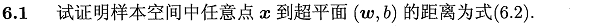

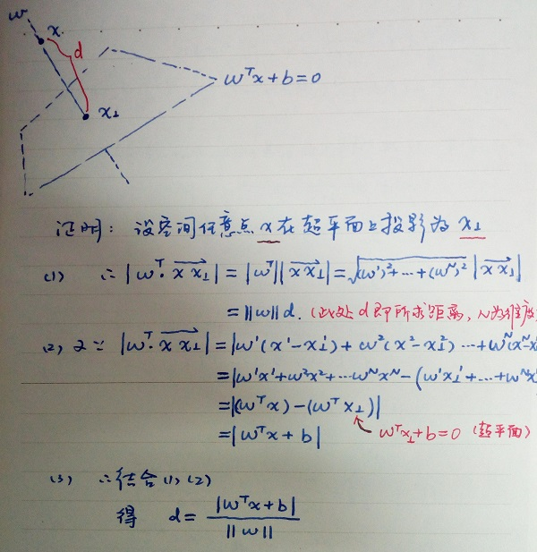

### 6.2 不同核函数对应的支持向量差别分析 ###
> 

本题的详细内容见：
[周志华《机器学习》课后习题解答系列（七）：Ch6.2 - 支持向量分析实验](http://blog.csdn.net/snoopy_yuan/article/details/74381508)

### 6.3 SVM与BP网络、C4.5决策树等的对比实验 ###
> 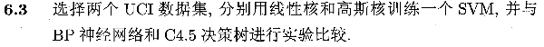

本题的详细内容见：
[周志华《机器学习》课后习题解答系列（七）：Ch6.3 - SVM对比实验](http://blog.csdn.net/snoopy_yuan/article/details/74530017)

### 6.4 线性核SVM与LDA的关联 ###
> 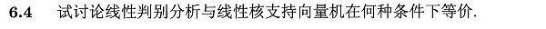

SVM与LDA均可用于样本最优划分超平面的求解，即法向向量 ω ，参考文献[Comparing Linear Discriminant Analysis and Support Vector Machines](http://download.springer.com/static/pdf/220/bok%253A978-3-540-36077-3.pdf?originUrl=https%3A%2F%2Flink.springer.com%2Fbook%2F10.1007%2F3-540-36077-8&token2=exp=1499156737~acl=%2Fstatic%2Fpdf%2F220%2Fbok%25253A978-3-540-36077-3.pdf%3ForiginUrl%3Dhttps%253A%252F%252Flink.springer.com%252Fbook%252F10.1007%252F3-540-36077-8*~hmac=7ab56d6335ba31c0ad0976c5f392ad4e41276365968e3f55595b189ce3c2d6c1#page=116)中对LDA与SVM的本质描述，一般有：

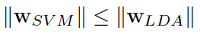

考虑到线性核SVM的输入空间与特征空间相同，那么取等的条件是：

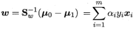

这说明两者生成的超平面相同，此时等效。

### 6.5 高斯核SVM与RBF网络的关联 ###
> 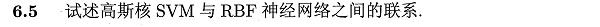

两种方法均采用径向基函数（RBF）如下：

 - SVM的超平面表示为：

 - RBF网络表示为：

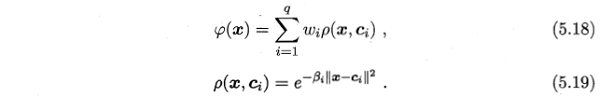

可以看出两者的表达式颇为相似，进一步分析，假设采用RBF网络作为一个二分类器，参考文献[Comparing Support Vector Machines with Gaussian Kernels to Radial Function Classiers](http://www.svms.org/comparison/Scholkopfetal1996.pdf)，两者分类函数对比如下：

 - SVM的分类器表示为：

 - RBF网络分类器表示为：

对于两个分类器，SVM的表达式多出了偏置项，同时其系数项 ω 只与支持向量有关；RBF网络的系数项 ω 与由输入样本训练得到，但是对于非支持向量对应的样本，其 ω数值相对非常小。

### 6.6 SVM对噪声的敏感分析 ###
> 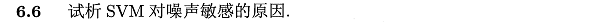

SVM的决策边界（超平面）是由支持向量所确定的，即是利用相对较少的数据特征来学得整个数据的特性。由于支持向量相对较少，其上的噪声会对超平面的确定产生相对较大的影响。

### 6.7 KKT条件推导 ###
> 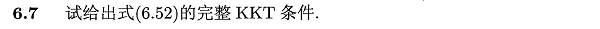

参考书中附录公式B.3，KKT条件即拉格朗日函数在对参数进行偏导取0计算后，为求得最优解，乘子和约束必须满足其中之一为0的条件。

要获取式（6.52）的完整KKT条件，只需将式（6.47~6.50）代入该式即可。

### 6.8 SVR实验 ###
> 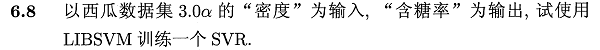

基于python-sklearn工具包，在线性核和高斯核下的SVR拟合如下图示：

> 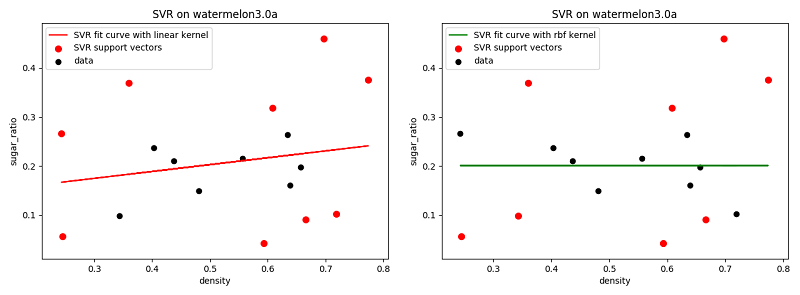

可以看出，由于数据自变量与因变量间关系随机性较强，采用SVR拟合效果不佳；

### 6.9 核对率回归模型设计 ###
> 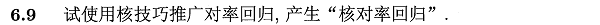

关于核对率回归（KLR），可参考书p132中关于 log 损失函数下SVM与LR的比较，也可参考台大林轩田-机器学习技法中关于KLR的slide。

简要说明如下：
> 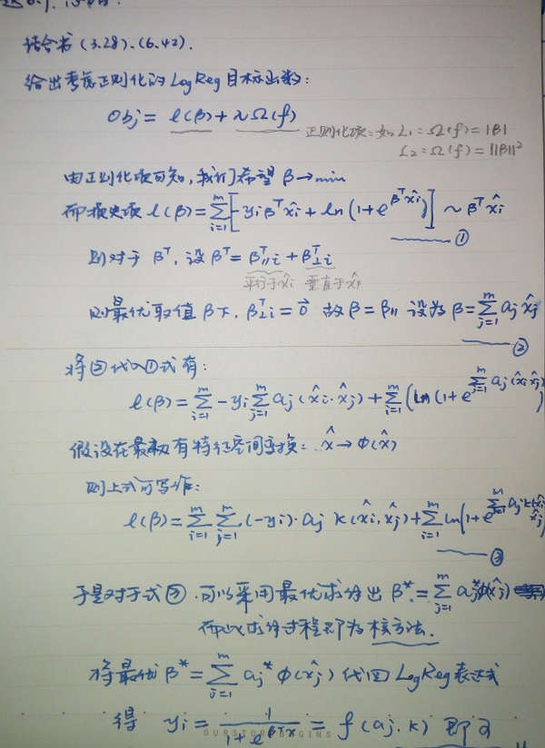

### 6.10 SVM改进设计 ###
> 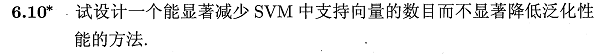

支持向量的规模与SVM计算速度息息相关，在不影响模型性能的情况下减少支持向量数目，能有效提高SVM效率。为此，一些稀松算法如 1-norm SVM, Lp-SVM, 自适应Lp-SVM 被提出，给出两篇参考文献如下：

 - [支持向量机的缺陷及改进算法](http://kns.cnki.net/KCMS/detail/detail.aspx?dbcode=CJFQ&dbname=CJFD2012&filename=JYXH201202003&uid=WEEvREcwSlJHSldRa1FhdXNXYXJwMHZqcDBjcTY4OENDZUZoU3RINlVXRT0=$9A4hF_YAuvQ5obgVAqNKPCYcEjKensW4ggI8Fm4gTkoUKaID8j8gFw!!&v=MDYxNzVoVTd6QUx6VFRackc0SDlQTXJZOUZaNFI4ZVgxTHV4WVM3RGgxVDNxVHJXTTFGckNVUkwyZllPUnFGeXo=)
 - [Support Vector Number Reduction: Survey and Experimental Evaluations](http://ieeexplore.ieee.org/document/6623200/)

