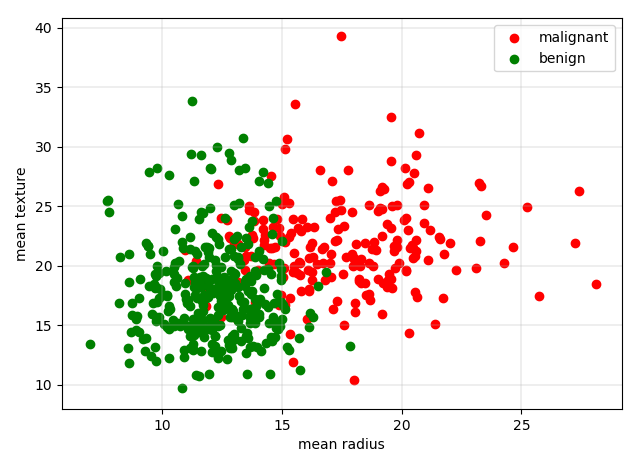

查看相关答案和源代码，欢迎访问我的Github：[PY131/Machine-Learning_ZhouZhihua](https://github.com/PY131/Machine-Learning_ZhouZhihua).

## 6.3 SVM对比实验 ##
> 

本题实验基于python，各种算法的实现基于的开源工具包和源码对应如下：
	
 - SVM -> sklearn
 - BP -> pybrain
 - C4.5 -> 来自[GitHub/ryanmadden/decision-tree](https://github.com/ryanmadden/decision-tree)

[这里查看本实验完整代码](https://github.com/PY131/Machine-Learning_ZhouZhihua/tree/master/ch6_support_vector_machine/6.3_SVM_compare)

这里我们选择UCI数据集 [Breast Cancer Data Set ](http://archive.ics.uci.edu/ml/datasets/Breast+Cancer) 进行分类实验，该数据集已经集成在sklearn中，可以直接采用```sklearn.datasets.load_breast_cancer```获取。

### 数据预处理分析 ###

关于该数据集的相关信息参考sklearn官网[sklearn.datasets.load_breast_cancer](http://scikit-learn.org/dev/modules/generated/sklearn.datasets.load_breast_cancer.html#sklearn.datasets.load_breast_cancer)，关键信息如下：

	类别：'malignant(恶性)' 'benign(良性)'，共两类；
	样本规模：[n_sample,n_feature] = [569, 30],；
			 正负样本数为 212(M),357(B)；
			 特征数值特性：实数，正值；

加载数据，选择前两个特征可视化出散点图如下所示：



上图中，绿色为良性(肿瘤)，红色对应恶性，于是可直观看出，体积越大恶性概率越高。

经过预分析，我认为该数据集可以直接用于SVM，BPnet，C4.5的模型学习。

### 模型训练与测试 ###

首先将数据集随机划分为相等了两部分，一部分作训练，一部分作测试。然后采用三种模型来拟合训练集，并在测试集上进行分类预测。在训练SVM和BP网络时，需对数据进行归一化处理，这里采用```sklearn.preprocessing.normalize```实现。

划分数据集与归一化程序如下示：
	
	```python
	from sklearn import preprocessing
	from sklearn.cross_validation import train_test_split
	
	normalized_X = preprocessing.normalize(X)
	X_train, X_test, y_train, y_test = train_test_split(normalized_X, y, test_size=0.5, random_state=0)
	```

下面是三种模型的训练和测试的程序和结果示意：

1. SVM - 基于sklearn，分别采用线性核和高斯核进行实验。

		```python
		clf = svm.SVC(C=C, kernel=kernel) kernel
		# train
		clf.fit(X_train, y_train)
		# testing 
		y_pred = clf.predict(X_test)
		```

	得出分类精确度如下：

		max accuracy of linear kernel SVM: 0.937
		max accuracy of rbf kernel SVM: 0.933

2. BP net - 基于pybrain，采用“标准BP算法+Softmax输出层激活函数”构建二分类器。

		```python
		from pybrain.tools.shortcuts     import buildNetwork
		from pybrain.structure.modules   import SoftmaxLayer
		from pybrain.supervised.trainers import BackpropTrainer
		
		n_hidden = 600
		bp_nn = buildNetwork(trndata.indim, n_hidden, trndata.outdim, outclass=SoftmaxLayer)
		trainer = BackpropTrainer(bp_nn, 
		                          dataset=trndata,
		                          verbose=True,
		                          momentum=0.2,
		                          learningrate=0.0002)
		err_train, err_valid = trainer.trainUntilConvergence(maxEpochs=1000)
		```

	得出测试集分类精确度如下：
	
		epoch: 1001  test error:  6.69%
	

3. C4.5，参考[ryanmadden/decision-tree - GitHub](https://github.com/ryanmadden/decision-tree)。

	[点击查看C4.5实验源码](https://github.com/PY131/Machine-Learning_ZhouZhihua/blob/master/ch6_support_vector_machine/6.3_SVM_compare/c45_clf.py)

	得出测试集分类精确度如下：

		accuracy of C4.5 tree: 0.909

### 模型对比 ###

 - 资源消耗：BP神经网络训练消耗计算机资源最大，SVM也比较耗资源，C4.5决策树消耗资源最小，训练速度极快。
 
 - 参数调节：BP网络的精度受模型结构和参数的设定影响较大，需要耐心的调参。不同核函数下的SVM精度与数据对象特性息息相关，实践中也是结合参数（如惩罚系数）要不断调试的，决策树-C4.5算法则相对固定一些。
 
 - 模型精度：只要模型与参数设置得当，经过足够的训练甚至交叉验证等，三种模型均可表现出不错的精度。

### 参考 ###

下面列出本实验涉及到的一些重要的参考资料：
 
 - [Pybrain官网样例 - Classification with Feed-Forward Neural Networks](http://pybrain.org/docs/tutorial/fnn.html)；
 - [ryanmadden/decision-tree](https://github.com/ryanmadden/decision-tree)：来自于GitHub的C4.5算法决策树分类器源码；